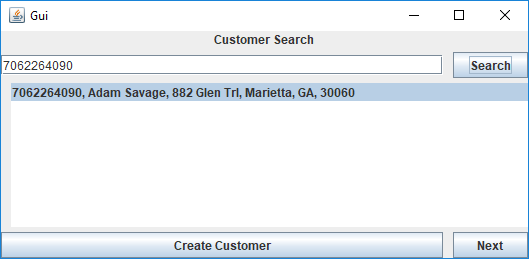
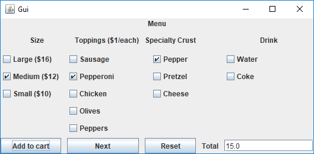
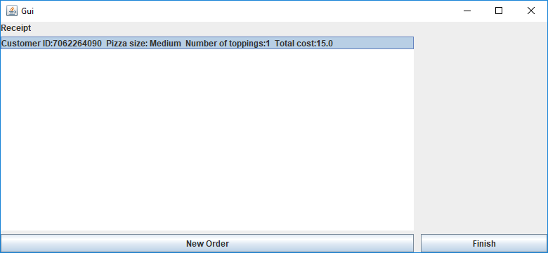
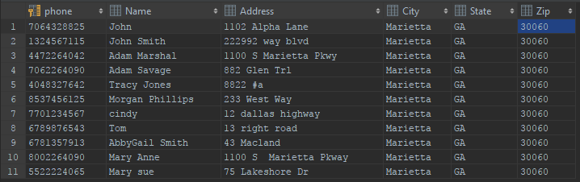

# PizzaProgram

Introduction to Software Engineering project.

This program is a point of sale system for pizza resturants. It stores customer and order data using SQLite and calculates the total through menu selections. Customer data is searchable within the program. 

